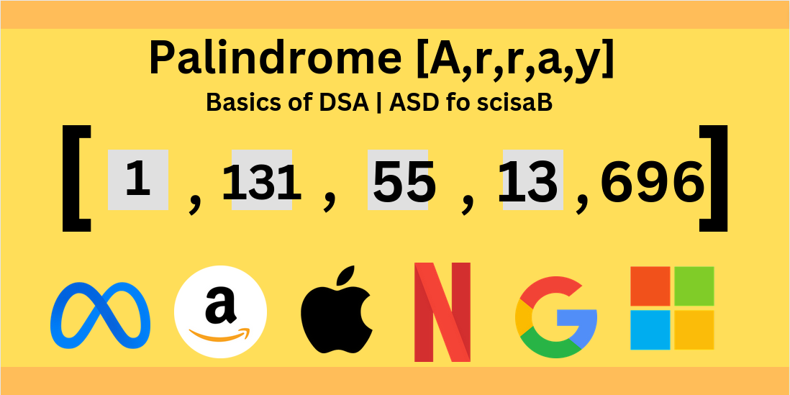

# Palindromic Array

> Problem link: https://www.geeksforgeeks.org/problems/palindromic-array-1587115620/1

3 Different ways to solve | step to be the great coder

Above given is the solution towards this problem with different approaches. A simple, concise approach.

If this helped you even a bit, please consider to LIKE and subscribe.