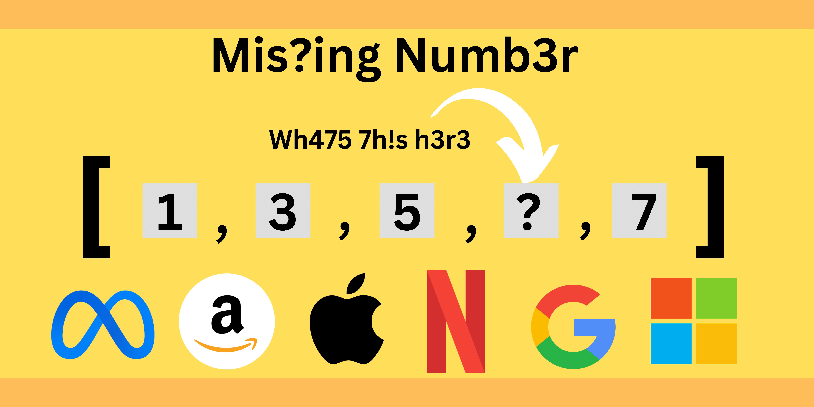

# 268. Missing Number

> link : https://leetcode.com/problems/missing-number/description/

> details : https://youtu.be/gD5md8uyB7o

## TL;DR

## Question
Given an array nums containing n distinct numbers in the range [0, n], return the only number in the range that is missing from the array.

Example 1:

Input: nums = [3,0,1]
Output: 2
Explanation: n = 3 since there are 3 numbers, so all numbers are in the range [0,3]. 2 is the missing number in the range since it does not appear in nums.
Example 2:

Input: nums = [0,1]
Output: 2
Explanation: n = 2 since there are 2 numbers, so all numbers are in the range [0,2]. 2 is the missing number in the range since it does not appear in nums.
Example 3:

Input: nums = [9,6,4,2,3,5,7,0,1]
Output: 8
Explanation: n = 9 since there are 9 numbers, so all numbers are in the range [0,9]. 8 is the missing number in the range since it does not appear in nums.
 

Constraints:

n == nums.length
1 <= n <= 104
0 <= nums[i] <= n
All the numbers of nums are unique.

Follow up: Could you implement a solution using only O(1) extra space complexity and O(n) runtime complexity?

